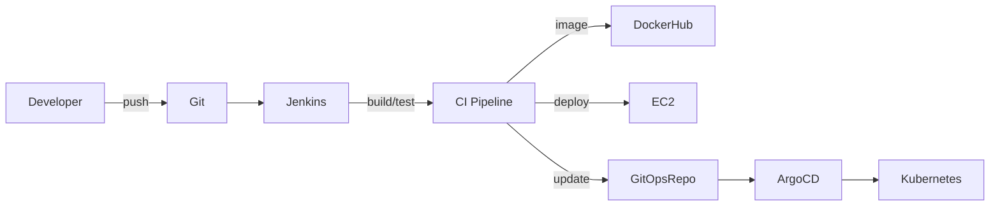

# Solar System NodeJS Application

> A modern Node.js + Express + MongoDB demo that displays planets in the Solar System.

---

## 🚀 Overview

This repository contains a small Node.js application and a Jenkins CI/CD pipeline that:

- installs dependencies and runs tests
- audits dependencies and checks code coverage
- builds and scans Docker images
- deploys to AWS EC2 for `feature/*` branches
- updates a Kubernetes GitOps repo and raises a Gitea PR for `PR*` branches

The Jenkins pipeline also uses a shared library called `shared-libraries@feature/trivy` for Trivy scanning.

---

## ✅ Quick Start

### Install dependencies

# Solar System Node.js Application

[](https://jenkins.example.com)
[](https://hub.docker.com)
[](#)
[](#)

> A modern Node.js + Express + MongoDB demo that displays planets in the Solar System.

---

## Table of Contents

- [Overview](#overview)
- [Quick Start](#quick-start)
- [Jenkins CI/CD](#jenkins-cicd)
- [Architecture](#architecture)
- [Deployment](#deployment)
- [Environment & Credentials](#environment--credentials)
- [Troubleshooting](#troubleshooting)
- [Contributing](#contributing)
- [License](#license)

---

## Overview

This repository contains a small Node.js application and a Jenkins pipeline that automates build, test, security scanning, image publishing, and deployment.

Key highlights:
- Builds Docker images for `feature/*` and `main` branches
- Uses a shared Jenkins library: `shared-libraries@feature/trivy` for Trivy scanning and report conversion
- Deploys to AWS EC2 for `feature/*` branches and updates a Kubernetes GitOps repository for `PR*` branches

---

## Quick Start

### Prerequisites

- Node.js 22.x (the Jenkins pipeline uses `NodeJs-22-15-0`)
- npm
- Docker (for building and local testing)
- Optional: MongoDB if testing with a live database

### Install

```bash
npm install
```

### Run Locally

```bash
npm start
# then open http://localhost:4000/
```

### Tests & Coverage

```bash
npm test
npm run coverage
```

---

## Jenkins CI/CD

The `Jenkinsfile` in this repo defines a multi-stage pipeline. Important stages and behavior:

- Install dependencies: `npm install --no-audit`
- Dependency audit: `npm audit --audit-level=critical`
- Unit tests: `npm test`
- Code coverage: `npm run coverage` (non-blocking, sets UNSTABLE on failure)
- SAST (SonarQube): runs for `feature/*` branches using `sonar-scanner` and coverage report path
- Build Docker Image: runs on `feature/*` and `main`, image is tagged with `GIT_COMMIT`
- Cleaning Old Images: removes older tags for the same repository
- Trivy Vulnerability Scanner: invoked via the shared library `shared-libraries@feature/trivy`; configured to fail the build on `CRITICAL` severity
- Push Image to Registry: for `feature/*` branches using `docker-crds` credentials
- Deploy to AWS: SSH into EC2 and run the container (exposed at port `4000`)
- Update Kubernetes & Raise PR: on `PR*` branches the pipeline clones the GitOps repo, updates `deployment.yaml`, commits a new branch, and opens a Gitea PR
- Manual approval: an `input` step waits for deployment confirmation before running DAST (OWASP ZAP)

### [Shared Library](../../../jenkins-sharedLib-for-solar-system-app)  <-- Repo Link

The pipeline begins with:

```groovy
@Library('shared-libraries@feature/trivy') _
```

This imports reusable Trivy helper scripts (`trivyScanScript`) for vulnerability scanning and report conversion. Keep the shared library in sync with your Jenkins master to ensure scanning behavior matches expectations.

---

## Architecture



---

## Deployment (high level)

- For `feature/*` branches the pipeline builds the image, scans it, pushes to registry, then SSHs to the configured EC2 host and runs the container.
- For `PR*` branches the pipeline updates the GitOps repo with the new image tag and opens a Gitea PR; ArgoCD (or a GitOps operator) will pick up the change after merge.

Example of remote run script executed on EC2:

```bash
sudo docker pull ${IMAGE_NAME}:${IMAGE_TAG}
sudo docker stop solar-system || true
sudo docker rm solar-system || true
sudo docker run -d --name solar-system \
  -e "MONGO_URI=${MONGO_URI}" \
  -e "MONGO_USERNAME=${MONGO_USERNAME}" \
  -e "MONGO_PASSWD=${MONGO_PASSWD}" \
  -p 4000:4000 \
  ${IMAGE_NAME}:${IMAGE_TAG}
```

---

## Environment & Credentials

The Jenkinsfile references several environment variables and credentials (manage these in Jenkins Credentials):

- `MONGO_URI` — MongoDB connection string
- `MONGO_USERNAME` — Jenkins credential `mongo-db-username`
- `MONGO_PASSWD` — Jenkins credential `mongo-db-passwd`
- `EC2_HOST` — Jenkins credential `ec2-host`
- `SSH_USER` — SSH user (defaults to `ubuntu` in pipeline)
- `GITEA_TOKEN` — Jenkins credential `gitea-api-token` (used to push PRs)
- `docker-crds` — credentialsId used for pushing images
- `SONAR_SCANNER_HOME` — Sonar scanner tool installation name in Jenkins

Keep these secrets out of source control and rotate periodically.

---

## Troubleshooting

- Pipeline fails during Trivy: check the shared library version and Trivy DB freshness.
- SSH deploy fails: ensure `EC2_HOST` is correct and `aws-ec2` credential exists in Jenkins.
- SonarQube errors: confirm `sonar-qube-server` is available and `SONAR_SCANNER_HOME` is configured on the agent.

Logs to inspect:

- Jenkins build console output
- Trivy HTML reports (published by the pipeline)
- EC2 system logs (`/var/log/syslog` or `journalctl -u docker`)

---

## Contributing

Contributions are welcome. Please follow the branch patterns used by CI:

- Feature branches: `feature/<name>`
- PR branches: `PR<id>` (used to trigger GitOps update and PR flow)

When opening PRs, ensure tests and coverage run locally.

---

## License

MIT

---

If you'd like, I can also:

- add real badges that link to your Jenkins/DockerHub endpoints
- add a short `deployment.md` with step-by-step EC2 instructions
- create a `CONTRIBUTING.md` with a template for PRs and testing checklist

Tell me which of those you'd like next.

---

## 🧪 Local Application

The app is served by `app.js` and binds to:

```js
app.listen(4000, '0.0.0.0', () => {
  console.log('Server successfully running on port - 4000');
});
```

---

## 💡 Tips

- If you want to test the Jenkins pipeline locally, keep the branch patterns in mind: `feature/*`, `main`, and `PR*`.
- The shared Trivy library handles vulnerability scanning and report conversion.
